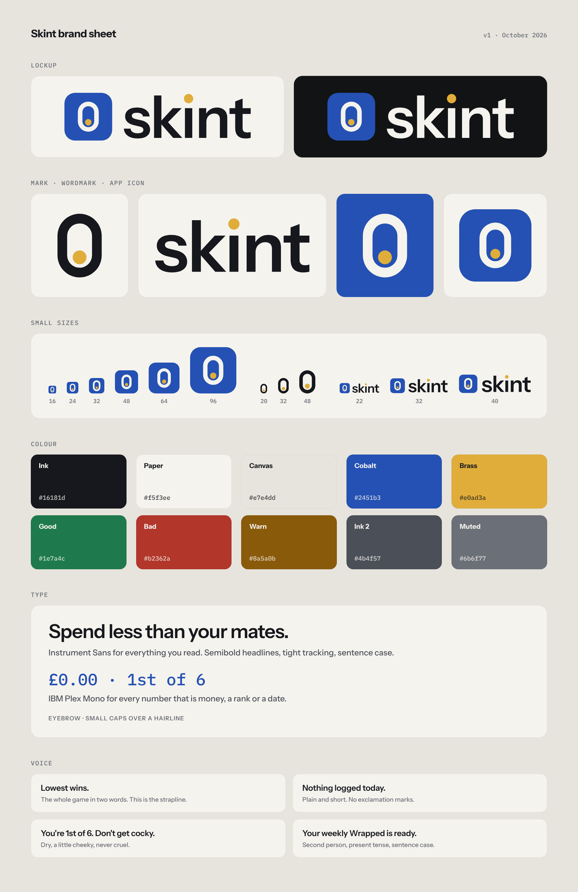

# Skint brand

Skint is a league for friends who compete to spend the least. Everything here follows from that: a
game, not a budgeting tool, and British to the bone.



## The name

*Skint*: British slang for having no money. It is what everyone in the league is pretending to be,
and what the winner actually is. One word, one syllable, and it already sounds like a verb your
mates will use ("log it on Skint", "Skint Wrapped").

- In prose, write **Skint** with a capital S, like a name. Never "SKINT", never "the Skint app".
- The wordmark is lowercase **skint**. That is a drawing, not a spelling.
- "Wrapped" keeps its capital. "Skint Wrapped" is the recap, "weekly Wrapped" in running copy.

## The mark: the last penny

A zero-shaped ring with one coin resting at the bottom. It reads three ways, all of them right:
the **0** you are trying to spend, a **pocket** with the last penny in it, and a **jar** that is
nearly empty. The ring takes the text colour; the penny is always brass.

- Drawn on a 64 grid: a pill 32 × 46 with a 7 unit stroke, penny radius 5, resting 2.5 above the
  inner bottom. The tight box is `viewBox="16 9 32 46"`.
- The penny never moves to the centre. Centred, it is just a dotted zero.
- Minimum size 16 px tall. Below that use the app tile, which has the cobalt behind it.

## The wordmark

"skint" set in Instrument Sans SemiBold, tracked −18/1000 em, with the dot of the **i** replaced
by the brass penny. The letters are outlines in the SVG, so it renders without the font.

- Always lowercase, always this drawing. Do not retype it in Instrument Sans and call it the logo.
- Ink on paper, paper on ink or cobalt. Never brass or cobalt letters.

## The lockup

The app tile (cobalt rounded square with the paper mark) beside the wordmark. The tile is a touch
taller than the ascender of the k and centred on it, so it reads as an icon next to a word rather
than a letter in front of it. Use the lockup wherever the product introduces itself: the landing
page, the invite page, the Open Graph image, the README. Inside the app the name barely appears;
the camera button and the leaderboard are the brand there.

- Clear space: the height of the penny on every side, at minimum. More is better.
- Minimum height 22 px. At 22 px the penny is still a distinct dot; below that it smears.
- Keep the tile cobalt in dark mode too. The accent in the UI lightens for dark backgrounds; the
  brand tile does not.

## Colour

| Name   | Hex       | Use                                                                 |
| ------ | --------- | ------------------------------------------------------------------- |
| Ink    | `#16181d` | Text, the mark and wordmark on light backgrounds                    |
| Paper  | `#f5f3ee` | Page background, the mark on cobalt and dark backgrounds            |
| Canvas | `#e7e4dd` | Outside the phone frame, the brand sheet                            |
| Cobalt | `#2451b3` | The app tile, buttons, the camera, links. The one accent in the UI  |
| Brass  | `#e0ad3a` | The penny. Nothing else                                             |
| Good   | `#1e7a4c` | Under budget, confirmed, streak kept                                |
| Bad    | `#b2362a` | Over, challenged, penalty                                           |
| Warn   | `#8a5a0b` | Nothing logged today                                                |

Brass is reserved. It is what makes the penny the penny, so it is not a button colour, a text
colour or a chart colour. Dark-mode values for the UI tokens live in `src/app/globals.css`.

## Type

- **Instrument Sans** for everything you read. Headlines at 600 with −0.025em tracking, body at
  400 and 500, sentence case throughout. Headlines are short sentences that end in a full stop:
  "Spend less than your mates." "Lowest wins."
- **IBM Plex Mono** for every number that is money, a rank, a streak or a date, at 500 or 600.
  Money is the hero number in this product, so it gets its own voice. Also for invite codes.
- **Eyebrows**: 12 px, 600, 0.08em tracking, uppercase, muted. One per section, over a hairline.

## Voice

Dry, short, a bit cheeky, never cruel. The product is a running joke between friends, and the
copy should sound like the friend who keeps score.

- **Second person, present tense.** "You're 1st of 6." not "User is currently ranked first."
- **Short sentences with full stops.** No exclamation marks. No emoji in UI copy; the Wrapped
  slides can have them because they are a story.
- **Say the number.** "£4.50 at Pret" beats "a small coffee purchase".
- **Tease the group, not the person.** "Someone spent £62 on a Tuesday." is fine. Naming and
  shaming is for the leaderboard, which does it with numbers.
- **The strapline is "Lowest wins."** Two words, the whole game. "Spend less than your mates." is
  the headline for people who have not joined yet.

Good: "Nothing logged today." "Lowest wins." "That invite link doesn't work." "Don't get cocky."

Not: "Oops! Something went wrong 😅" "Welcome to your personalised savings journey" "Crush your
budget goals".

## Files

| File                                  | What it is                                                 |
| ------------------------------------- | ---------------------------------------------------------- |
| `skint-lockup.svg` / `-paper.svg`     | Tile + wordmark, ink or paper letters                      |
| `skint-wordmark.svg` / `-paper.svg`   | The wordmark alone                                         |
| `skint-mark.svg` / `-paper.svg`       | The ring and penny, ink or paper                           |
| `skint-mark-mono.svg`                 | The mark in `currentColor`, for single-colour contexts     |
| `skint-app-icon.svg` / `.png`         | The app tile at 512 / 1024 px                              |
| `preview.png`                         | The brand sheet above                                      |
| `../src/components/Logo.tsx`          | `Mark`, `Tile`, `Wordmark` and `Lockup` as React inline SVG |
| `../src/app/icon.svg`, `favicon.ico`  | Favicon (Next.js picks these up automatically)             |
| `../src/app/apple-icon.png`           | iOS home-screen icon, 180 px, square (iOS rounds it)       |
| `../src/app/opengraph-image.png`      | Link preview, 1200 × 630                                   |
| `../public/icons/*.png`               | PWA icons from `src/app/manifest.ts`, incl. maskable       |

## Regenerating

All of the above is produced by `generate.py`, which bakes the font outlines into the SVGs and
screenshots the raster files with headless Chromium:

```bash
pip install fonttools uharfbuzz brotli pillow
python3 brand/generate.py
```

The first run fetches Instrument Sans and IBM Plex Mono from Google Fonts into `brand/.fonts/`
(gitignored). If the mark or wordmark geometry changes, copy the new numbers from
`brand/.fonts/geometry.json` into `src/components/Logo.tsx`.
